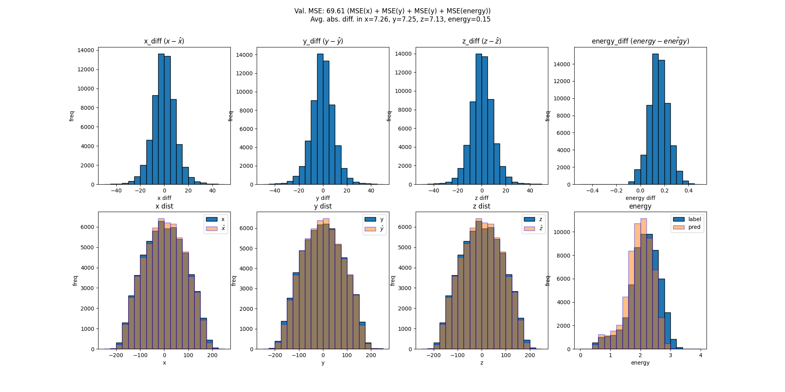
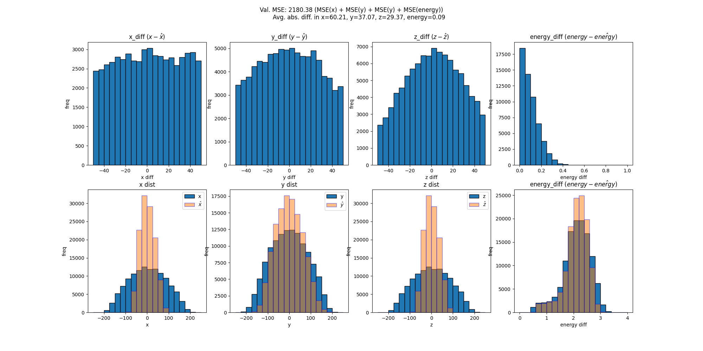

Steps:
1. Add data called `train_X_y_ver_all_xyz_energy.pt` into `/data` folder
2. Install packages `pip install -r requirements.txt` (Should work but haven't tested. Let eugene know if it doesn't)
3. run `. multiple_exp.sh` (edit bash file to change configuration such as adding --debug to run sample of data)
4. See if you can replicate plots inside `example_plots` folder

Notes:
- Full training should take ~20 min (based on 4 x A5000)
- The code is agnostic of device (gpu, cpu, multi-gpu)

Example Plots:

Full training plot

Debug mode plot

